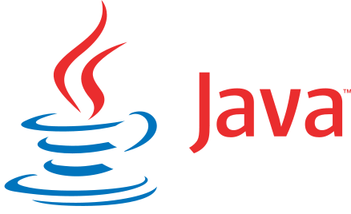

# Programming Languages
Griffon includes the following programming languages as well as modules relevant to data science.

## Java
Java is a general purpose programming language that is extremely useful in the big data ecosystem as many big data tools are implemented in Java, or are written on languages that use the Java Virtual Machine (JVM).  In addition to the Java Development Kit (JDK), Griffon also includes the Maven build automation tool as well as the IntelliJ IDE Community Edition for Java.

## Juliet

## NodeJS

## PHP

## Pig

## Python

## R

## Ruby

## Scala
